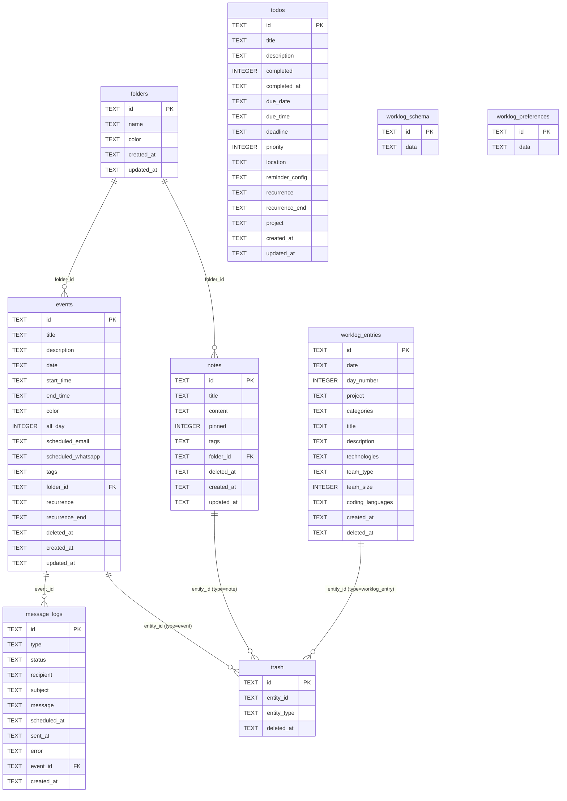

# Database Schema Diagram

Full entity-relationship diagram for all 9 tables in the Turso (libSQL/SQLite) database.

---

## Mermaid ERD



---

## ASCII Layout

```
                          ┌─────────────┐
                          │   folders   │
                          │─────────────│
                          │ PK id       │
                          │    name     │
                          │    color    │
                          └──────┬──────┘
                    folder_id    │    folder_id
              ┌──────────────────┤
              ▼                  ▼
    ┌──────────────┐    ┌───────────────┐
    │    notes     │    │    events     │
    │──────────────│    │───────────────│
    │ PK id        │    │ PK id         │
    │    title     │    │    title      │
    │    content   │    │    date       │
    │    pinned    │    │    start_time │
    │    tags      │    │    end_time   │
    │    folder_id │    │    color      │
    │    deleted_at│    │    all_day    │
    │    created_at│    │    tags       │
    │    updated_at│    │    folder_id  │
    └──────┬───────┘    │    sched_email│
           │            │    sched_wa   │
           │            │    recurrence │
           │            │    deleted_at │
           │            │    created_at │
           │            └───────┬───────┘
           │ entity_id          │ entity_id / event_id
           └──────────┬─────────┘
                      │           ┌────────────────────┐
                      ▼           │    message_logs    │
              ┌───────────┐       │────────────────────│
              │   trash   │       │ PK id              │
              │───────────│       │    type            │
              │ PK id     │       │    status          │
              │ entity_id │       │    recipient       │
              │ entity_type│      │    subject         │
              │ deleted_at│       │    message         │
              └─────┬─────┘       │    scheduled_at    │
                    │             │    sent_at         │
         also       │             │    error           │
         entity_id  │             │ FK event_id ───────┘
              ┌─────┘
              ▼
    ┌────────────────────┐
    │  worklog_entries   │
    │────────────────────│
    │ PK id              │
    │    date            │
    │    day_number      │
    │    project         │
    │    categories      │
    │    title           │
    │    description     │
    │    technologies    │
    │    team_type       │
    │    team_size       │
    │    coding_languages│
    │    created_at      │
    │    deleted_at      │
    └────────────────────┘

    ┌────────────────────┐    ┌──────────────────────────┐
    │  worklog_schema    │    │   worklog_preferences    │
    │────────────────────│    │──────────────────────────│
    │ PK id='default'    │    │ PK id='default'          │
    │    data (JSON)     │    │    data (JSON)           │
    └────────────────────┘    └──────────────────────────┘

    ┌──────────────────────────────────────────────────────┐
    │                        todos                         │
    │──────────────────────────────────────────────────────│
    │ PK id  title  description  completed  completed_at   │
    │  due_date  due_time  deadline  priority  location     │
    │  reminder_config  recurrence  recurrence_end          │
    │  project  created_at  updated_at                      │
    └──────────────────────────────────────────────────────┘
    (no FK relationships — standalone table)
```

---

## Table Summary

| Table | Rows | Soft-delete | Purpose |
|---|---|---|---|
| `folders` | many | no | Groups notes and events |
| `notes` | many | yes (`deleted_at`) | Rich-text notes (BlockNote JSON) |
| `events` | many | yes (`deleted_at`) | Calendar events with scheduling |
| `trash` | many | — | Mirror of soft-deleted notes, events, worklog entries |
| `message_logs` | many | no | Email/WhatsApp send audit log |
| `todos` | many | no | Tasks with due dates, reminders, priority |
| `worklog_entries` | many | yes (`deleted_at`) | Daily work journal entries |
| `worklog_schema` | 1 row | no | Config doc: projects, categories, technologies |
| `worklog_preferences` | 1 row | no | UI preferences for Daily Log form |

---

## Soft-Delete Pattern

Three tables support soft-delete: `notes`, `events`, and `worklog_entries`.

```
Delete action
    ├─► UPDATE <table> SET deleted_at = now() WHERE id = ?
    └─► INSERT INTO trash (entity_id, entity_type, deleted_at)

Restore action
    ├─► UPDATE <table> SET deleted_at = NULL WHERE id = ?
    └─► DELETE FROM trash WHERE id = ?

Permanent delete
    ├─► DELETE FROM <table> WHERE id = ?
    └─► DELETE FROM trash WHERE id = ?
```

`entity_type` values: `'note'` | `'event'` | `'worklog_entry'`

---

## JSON Column Shapes

| Table.Column | Type | Example |
|---|---|---|
| `events.tags` | `string[]` | `["work","family"]` |
| `events.scheduled_email` | `ScheduledEmail \| null` | `{ to, subject, body, scheduledAt, sent }` |
| `events.scheduled_whatsapp` | `ScheduledWhatsApp \| null` | `{ to, message, scheduledAt, sent }` |
| `notes.tags` | `string[]` | `["recipes"]` |
| `notes.content` | `BlockNote[]` | `[{ id, type, content, children }]` |
| `todos.reminder_config` | `ReminderItem[] \| null` | `[{ id, mode, value }]` |
| `worklog_entries.categories` | `string[]` | `["feature","bug fix"]` |
| `worklog_entries.technologies` | `TechSelection[]` | `[{ tech, subTechs[] }]` |
| `worklog_entries.coding_languages` | `string[]` | `["Python","TypeScript"]` |
| `worklog_schema.data` | `Schema` | `{ projects[], categories[], technologies[] }` |
