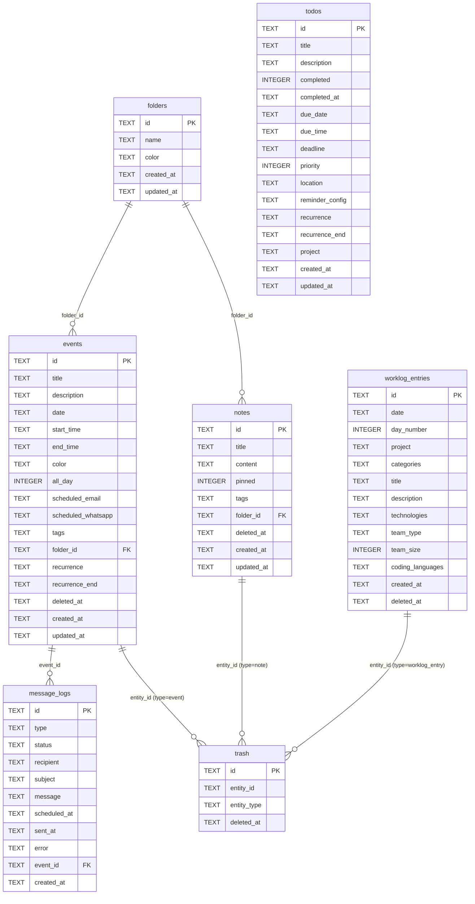

# Database Documentation

The app uses **Turso** — a cloud-hosted SQLite database built on [libSQL](https://github.com/tursodatabase/libsql).
The driver is `@libsql/client`. The database lives in Turso's cloud; nothing is stored locally.

---

## Overview

| Detail | Value |
|---|---|
| Provider | [Turso](https://turso.tech) (libSQL / cloud SQLite) |
| Driver | `@libsql/client` |
| Connection file | `lib/db.ts` |
| Tables | `events`, `message_logs`, `notes`, `folders`, `trash`, `todos`, `worklog_entries`, `worklog_schema`, `worklog_preferences` |
| Init strategy | `CREATE TABLE IF NOT EXISTS` + protective `ALTER TABLE` migrations on every cold start |
| ID format | UUID v4 (generated by `node:crypto` `randomUUID()`) |
| Timestamps | ISO 8601 strings stored as `TEXT` (SQLite has no native DATETIME) |
| Soft deletes | `notes`, `events`, and `worklog_entries` have a `deleted_at TEXT` column; deleted rows are mirrored in `trash` |

---

## Init Flow

Every API function that needs the database calls `ensureInit()` from `lib/db.ts`.

```
Cold start
    │
    ▼
getClient()
    │  reads TURSO_DATABASE_URL + TURSO_AUTH_TOKEN from env
    │  creates a libSQL Client (singleton — one per cold start)
    ▼
_initialized?
    │  yes ──► return client immediately (skip DDL)
    │  no
    ▼
CREATE TABLE IF NOT EXISTS events           (full schema, safe to re-run)
CREATE TABLE IF NOT EXISTS message_logs     (safe to re-run)
CREATE TABLE IF NOT EXISTS notes            (full schema, safe to re-run)
CREATE TABLE IF NOT EXISTS folders          (safe to re-run)
    │
    ▼
Backward-compat ALTER TABLE migrations      (try/catch — ignored if column exists)
    │  notes:            folder_id, deleted_at
    │  events:           tags, folder_id, recurrence, recurrence_end, deleted_at
    │  worklog_entries:  deleted_at
    │  (for DBs created before these columns were added to the CREATE TABLE)
    ▼
CREATE TABLE IF NOT EXISTS trash            (safe to re-run)
CREATE TABLE IF NOT EXISTS todos            (full schema, safe to re-run)
CREATE TABLE IF NOT EXISTS worklog_entries  (full schema, safe to re-run)
CREATE TABLE IF NOT EXISTS worklog_schema   (safe to re-run)
CREATE TABLE IF NOT EXISTS worklog_preferences (safe to re-run)
    │
    ▼
Seed INSERT OR IGNORE rows                  (idempotent demo data)
    │  3 sample todos
    │  1 trashed note  + trash entry
    │  1 trashed event + trash entry
    │  5 real worklog entries (from user's CSV export)
    │  1 worklog schema document (user's full tech stack)
    ▼
_initialized = true
    │
    ▼
return client
```

Key design choices:
- **Singleton** — `_client` is module-level, so one TCP connection is reused across requests within the same serverless instance.
- **`IF NOT EXISTS`** — DDL runs on every fresh cold start but is safe to repeat.
- **Full CREATE TABLE** — all columns are declared up-front; no column is left to a migration alone.
- **Backward-compat migrations** — older DBs that existed before columns were added get them via `ALTER TABLE … ADD COLUMN` in a try/catch.

---

## Table: `events`

Stores calendar events. `scheduled_email` and `scheduled_whatsapp` are JSON blobs for message scheduling without extra tables. Soft-deleted when `deleted_at` is set; also mirrored in `trash`.

### Schema

```sql
CREATE TABLE IF NOT EXISTS events (
  id                 TEXT PRIMARY KEY,               -- UUID v4
  title              TEXT NOT NULL,
  description        TEXT,                           -- nullable
  date               TEXT NOT NULL,                  -- 'YYYY-MM-DD'
  start_time         TEXT,                           -- 'HH:mm', null = all-day
  end_time           TEXT,                           -- 'HH:mm', null = all-day
  color              TEXT DEFAULT 'indigo',
  all_day            INTEGER DEFAULT 1,              -- 1=true, 0=false
  scheduled_email    TEXT,                           -- JSON blob or NULL
  scheduled_whatsapp TEXT,                           -- JSON blob or NULL
  tags               TEXT NOT NULL DEFAULT '[]',     -- JSON string array
  folder_id          TEXT,                           -- FK → folders.id (nullable, unenforced)
  recurrence         TEXT NOT NULL DEFAULT 'none',   -- 'none'|'daily'|'weekly'|'monthly'|'yearly'
  recurrence_end     TEXT,                           -- 'YYYY-MM-DD' or NULL
  deleted_at         TEXT,                           -- NULL = active; ISO 8601 = soft-deleted
  created_at         TEXT DEFAULT (datetime('now')),
  updated_at         TEXT DEFAULT (datetime('now'))
)
```

### Column details

| Column | Type | Nullable | Notes |
|---|---|---|---|
| `id` | TEXT | NO | UUID v4 primary key |
| `title` | TEXT | NO | Event title |
| `description` | TEXT | YES | Optional notes |
| `date` | TEXT | NO | `YYYY-MM-DD` |
| `start_time` | TEXT | YES | `HH:mm` — null when `all_day = 1` |
| `end_time` | TEXT | YES | `HH:mm` — null when `all_day = 1` |
| `color` | TEXT | NO | `indigo` \| `emerald` \| `amber` \| `rose` \| `sky` \| `violet` |
| `all_day` | INTEGER | NO | `1` = true, `0` = false |
| `scheduled_email` | TEXT | YES | JSON `ScheduledEmail` object |
| `scheduled_whatsapp` | TEXT | YES | JSON `ScheduledWhatsApp` object |
| `tags` | TEXT | NO | JSON string array e.g. `["work","family"]` |
| `folder_id` | TEXT | YES | References `folders.id` (no enforced FK) |
| `recurrence` | TEXT | NO | `'none'` \| `'daily'` \| `'weekly'` \| `'monthly'` \| `'yearly'` |
| `recurrence_end` | TEXT | YES | Last date of recurrence, `YYYY-MM-DD` |
| `deleted_at` | TEXT | YES | NULL = active; ISO 8601 = soft-deleted |
| `created_at` | TEXT | NO | ISO 8601 UTC |
| `updated_at` | TEXT | NO | ISO 8601 UTC |

### `scheduled_email` JSON shape

```json
{
  "id": "uuid",
  "to": ["email@example.com"],
  "subject": "Reminder",
  "body": "Don't forget...",
  "scheduledAt": "2026-03-25T08:00:00.000Z",
  "sent": false,
  "sentAt": null
}
```

### `scheduled_whatsapp` JSON shape

```json
{
  "id": "uuid",
  "to": "+972501234567",
  "message": "Reminder text",
  "scheduledAt": "2026-03-25T08:00:00.000Z",
  "sent": false,
  "sentAt": null
}
```

---

## Table: `message_logs`

Tracks every message send attempt — both manual sends and cron-triggered scheduled sends.
The cron job (`/api/messages/cron`) queries this table for `status = 'pending'` rows and updates them after sending.

### Schema

```sql
CREATE TABLE IF NOT EXISTS message_logs (
  id           TEXT PRIMARY KEY,                       -- UUID v4
  type         TEXT NOT NULL,                          -- 'whatsapp' | 'email'
  status       TEXT NOT NULL DEFAULT 'pending',        -- 'pending' | 'sent' | 'failed'
  recipient    TEXT NOT NULL,                          -- phone number or comma-separated emails
  subject      TEXT,                                   -- email subject (null for WhatsApp)
  message      TEXT,                                   -- message body
  scheduled_at TEXT NOT NULL,                          -- ISO 8601 — when to send
  sent_at      TEXT,                                   -- ISO 8601 — when actually sent
  error        TEXT,                                   -- error message if status='failed'
  event_id     TEXT,                                   -- FK → events.id (nullable, unenforced)
  created_at   TEXT DEFAULT (datetime('now'))
)
```

### Column details

| Column | Type | Nullable | Notes |
|---|---|---|---|
| `id` | TEXT | NO | UUID v4 primary key |
| `type` | TEXT | NO | `'whatsapp'` or `'email'` |
| `status` | TEXT | NO | `'pending'` → `'sent'` or `'failed'` |
| `recipient` | TEXT | NO | Phone (`+972…`) or comma-separated emails |
| `subject` | TEXT | YES | Email subject; always NULL for WhatsApp |
| `message` | TEXT | YES | Message body text |
| `scheduled_at` | TEXT | NO | ISO 8601 UTC — cron checks `<= now()` |
| `sent_at` | TEXT | YES | Set by cron on successful send |
| `error` | TEXT | YES | Error string on failure |
| `event_id` | TEXT | YES | References `events.id` (no enforced FK) |
| `created_at` | TEXT | NO | Row creation timestamp |

---

## Table: `notes`

Stores rich-text notes created in the Notes page. Content is a BlockNote JSON array serialised as a string. Soft-deleted when `deleted_at` is set; also mirrored in `trash`.

### Schema

```sql
CREATE TABLE IF NOT EXISTS notes (
  id         TEXT PRIMARY KEY,                        -- UUID v4
  title      TEXT NOT NULL DEFAULT 'Untitled Note',
  content    TEXT NOT NULL DEFAULT '[]',              -- BlockNote JSON array as string
  pinned     INTEGER NOT NULL DEFAULT 0,              -- 1=pinned, 0=normal
  tags       TEXT NOT NULL DEFAULT '[]',              -- JSON string array
  folder_id  TEXT,                                    -- FK → folders.id (nullable, unenforced)
  deleted_at TEXT,                                    -- NULL = active; ISO 8601 = soft-deleted
  created_at TEXT DEFAULT (datetime('now')),
  updated_at TEXT DEFAULT (datetime('now'))
)
```

### Column details

| Column | Type | Nullable | Notes |
|---|---|---|---|
| `id` | TEXT | NO | UUID v4 primary key |
| `title` | TEXT | NO | Note title; defaults to `'Untitled Note'` |
| `content` | TEXT | NO | BlockNote block array serialised as JSON string |
| `pinned` | INTEGER | NO | `1` = pinned at top of list, `0` = normal |
| `tags` | TEXT | NO | JSON string array e.g. `["recipes","shopping"]` |
| `folder_id` | TEXT | YES | References `folders.id` (no enforced FK) |
| `deleted_at` | TEXT | YES | NULL = active; ISO 8601 = soft-deleted |
| `created_at` | TEXT | NO | ISO 8601 UTC |
| `updated_at` | TEXT | NO | ISO 8601 UTC |

### `content` JSON shape

The `content` field stores a [BlockNote](https://www.blocknotejs.org/) block array. Each element is a block object:

```json
[
  {
    "id": "block-uuid",
    "type": "paragraph",
    "content": [{ "type": "text", "text": "Hello world", "styles": {} }],
    "children": []
  }
]
```

---

## Table: `folders`

Colour-coded folders that group notes and events. Both `notes.folder_id` and `events.folder_id` reference this table (unenforced soft FK).

### Schema

```sql
CREATE TABLE IF NOT EXISTS folders (
  id         TEXT PRIMARY KEY,                        -- UUID v4
  name       TEXT NOT NULL DEFAULT 'New Folder',
  color      TEXT NOT NULL DEFAULT 'slate',           -- Tailwind colour name
  created_at TEXT DEFAULT (datetime('now')),
  updated_at TEXT DEFAULT (datetime('now'))
)
```

### Column details

| Column | Type | Nullable | Notes |
|---|---|---|---|
| `id` | TEXT | NO | UUID v4 primary key |
| `name` | TEXT | NO | Folder display name |
| `color` | TEXT | NO | Tailwind colour: `slate` \| `indigo` \| `emerald` \| `amber` \| `rose` \| `sky` \| `violet` |
| `created_at` | TEXT | NO | ISO 8601 UTC |
| `updated_at` | TEXT | NO | ISO 8601 UTC |

---

## Table: `trash`

Soft-delete mirror table. When a note, event, or worklog entry is deleted, `deleted_at` is set on the source row **and** a corresponding row is inserted here. The TrashPage reads this table. Restoring clears `deleted_at` on the source and removes the trash row. Permanent delete removes both.

### Schema

```sql
CREATE TABLE IF NOT EXISTS trash (
  id          TEXT PRIMARY KEY,                       -- UUID v4
  entity_id   TEXT NOT NULL,                          -- FK → notes.id, events.id, or worklog_entries.id
  entity_type TEXT NOT NULL,                          -- 'note' | 'event' | 'worklog_entry'
  deleted_at  TEXT NOT NULL                           -- ISO 8601 — when deleted
)
```

### Column details

| Column | Type | Nullable | Notes |
|---|---|---|---|
| `id` | TEXT | NO | UUID v4 primary key |
| `entity_id` | TEXT | NO | References `notes.id`, `events.id`, or `worklog_entries.id` (no enforced FK) |
| `entity_type` | TEXT | NO | `'note'`, `'event'`, or `'worklog_entry'` |
| `deleted_at` | TEXT | NO | ISO 8601 UTC timestamp of deletion |

### Soft-delete lifecycle

```
User clicks Delete (note / event / worklog entry)
    │
    ├─► UPDATE notes|events|worklog_entries SET deleted_at = now() WHERE id = ?
    └─► INSERT INTO trash (id, entity_id, entity_type, deleted_at) VALUES (...)

User clicks Restore (TrashPage)
    │
    ├─► UPDATE notes|events|worklog_entries SET deleted_at = NULL WHERE id = ?
    └─► DELETE FROM trash WHERE id = ?

User clicks Delete Forever (TrashPage)
    │
    ├─► DELETE FROM notes|events|worklog_entries WHERE id = ?
    └─► DELETE FROM trash WHERE id = ?

User clicks Empty Trash
    │
    ├─► DELETE FROM notes            WHERE id IN (SELECT entity_id FROM trash WHERE entity_type = 'note')
    ├─► DELETE FROM events           WHERE id IN (SELECT entity_id FROM trash WHERE entity_type = 'event')
    ├─► DELETE FROM worklog_entries  WHERE id IN (SELECT entity_id FROM trash WHERE entity_type = 'worklog_entry')
    └─► DELETE FROM trash
```

---

## Table: `todos`

Stores tasks with full scheduling metadata. Supports due dates, deadlines, priorities, reminders, recurrence, and project grouping.

### Schema

```sql
CREATE TABLE IF NOT EXISTS todos (
  id              TEXT PRIMARY KEY,                   -- UUID v4
  title           TEXT NOT NULL,
  description     TEXT,                               -- optional longer text
  completed       INTEGER NOT NULL DEFAULT 0,         -- 1=done, 0=active
  completed_at    TEXT,                               -- ISO 8601 — when completed
  due_date        TEXT,                               -- 'YYYY-MM-DD' scheduled date
  due_time        TEXT,                               -- 'HH:MM' (24h), null = no time
  deadline        TEXT,                               -- 'YYYY-MM-DD' hard deadline
  priority        INTEGER NOT NULL DEFAULT 4,         -- 1=highest … 4=none
  location        TEXT,                               -- optional location string
  reminder_config TEXT,                               -- JSON array of ReminderItem or NULL
  recurrence      TEXT NOT NULL DEFAULT 'none',       -- 'none'|'daily'|'weekly'|'monthly'|'yearly'
  recurrence_end  TEXT,                               -- 'YYYY-MM-DD' or NULL
  project         TEXT NOT NULL DEFAULT 'Inbox',      -- project/list name
  created_at      TEXT DEFAULT (datetime('now')),
  updated_at      TEXT DEFAULT (datetime('now'))
)
```

### Column details

| Column | Type | Nullable | Notes |
|---|---|---|---|
| `id` | TEXT | NO | UUID v4 primary key |
| `title` | TEXT | NO | Task title |
| `description` | TEXT | YES | Optional multi-line description |
| `completed` | INTEGER | NO | `1` = done, `0` = active |
| `completed_at` | TEXT | YES | ISO 8601 UTC — set when `completed = 1` |
| `due_date` | TEXT | YES | Scheduled date `YYYY-MM-DD` |
| `due_time` | TEXT | YES | Time of day `HH:MM` (24h) |
| `deadline` | TEXT | YES | Hard deadline `YYYY-MM-DD`, separate from due date |
| `priority` | INTEGER | NO | `1`=P1 (red) · `2`=P2 (orange) · `3`=P3 (blue) · `4`=none (gray) |
| `location` | TEXT | YES | Free-text location |
| `reminder_config` | TEXT | YES | JSON array of `ReminderItem` objects (see below) |
| `recurrence` | TEXT | NO | `'none'` \| `'daily'` \| `'weekly'` \| `'monthly'` \| `'yearly'` |
| `recurrence_end` | TEXT | YES | Recurrence stop date `YYYY-MM-DD` |
| `project` | TEXT | NO | Project/list name; default `'Inbox'` |
| `created_at` | TEXT | NO | ISO 8601 UTC |
| `updated_at` | TEXT | NO | ISO 8601 UTC |

### `reminder_config` JSON shape

```json
[
  { "id": "uuid", "mode": "datetime", "value": "30 minutes before" },
  { "id": "uuid", "mode": "before",   "value": "1 day before" }
]
```

`mode` is `"datetime"` (absolute: at time of task or N minutes/hours/days before) or `"before"` (relative to the due time).

---

## Table: `worklog_entries`

Work journal entries recorded in the Daily Log feature (`/daily-log`). Supports soft-delete — deleted entries are mirrored in `trash` and visible in the Trash page.

### Schema

```sql
CREATE TABLE IF NOT EXISTS worklog_entries (
  id               TEXT PRIMARY KEY,               -- UUID v4
  date             TEXT NOT NULL,                  -- 'YYYY-MM-DD'
  day_number       INTEGER NOT NULL DEFAULT 1,     -- user-tracked ordinal day count
  project          TEXT NOT NULL DEFAULT '',       -- from worklog_schema.projects
  categories       TEXT NOT NULL DEFAULT '[]',     -- JSON string array
  title            TEXT NOT NULL,                  -- short task title
  description      TEXT,                           -- optional free-text
  technologies     TEXT NOT NULL DEFAULT '[]',     -- JSON array of { tech, subTechs[] }
  team_type        TEXT NOT NULL DEFAULT 'solo',   -- 'solo' | 'team'
  team_size        INTEGER,                        -- null when solo
  coding_languages TEXT NOT NULL DEFAULT '[]',     -- JSON string array
  created_at       TEXT DEFAULT (datetime('now')),
  deleted_at       TEXT                            -- NULL = active; ISO 8601 = soft-deleted
)
```

### Column details

| Column | Type | Nullable | Notes |
|---|---|---|---|
| `id` | TEXT | NO | UUID v4 primary key |
| `date` | TEXT | NO | `YYYY-MM-DD` — the date worked |
| `day_number` | INTEGER | NO | Ordinal day count, user-tracked, starts at 1 |
| `project` | TEXT | NO | Project name from `worklog_schema` |
| `categories` | TEXT | NO | JSON string array e.g. `["feature","bug fix"]` |
| `title` | TEXT | NO | Short task title (required) |
| `description` | TEXT | YES | Optional longer description |
| `technologies` | TEXT | NO | JSON array of `{ tech: string, subTechs: string[] }` |
| `team_type` | TEXT | NO | `'solo'` or `'team'` |
| `team_size` | INTEGER | YES | Number of people — null when `team_type = 'solo'` |
| `coding_languages` | TEXT | NO | JSON string array e.g. `["Python","TypeScript"]` |
| `created_at` | TEXT | NO | ISO 8601 UTC — insertion time |
| `deleted_at` | TEXT | YES | NULL = active; ISO 8601 = soft-deleted |

### Indexes

```sql
CREATE INDEX idx_worklog_entries_date    ON worklog_entries(date DESC, created_at DESC);
CREATE INDEX idx_worklog_entries_project ON worklog_entries(project);
```

---

## Table: `worklog_schema`

Single-row configuration document (id = `'default'`) defining the available options in the Daily Log form.

### Schema

```sql
CREATE TABLE IF NOT EXISTS worklog_schema (
  id   TEXT PRIMARY KEY,   -- always 'default'
  data TEXT NOT NULL       -- JSON document (see shape below)
)
```

### `data` JSON shape

```json
{
  "projects": ["Study", "Weekeye"],
  "categories": ["bug fix", "feature", "meeting", "research", ...],
  "projectInfos": {},
  "technologies": [
    { "name": "Python", "group": "languages", "subTechs": ["FastAPI", "Django", ...] },
    { "name": "Docker", "group": "data_engineering", "subTechs": [...] }
  ]
}
```

---

## Table: `worklog_preferences`

Single-row preferences document (id = `'default'`) storing UI state for the Daily Log page (e.g. last-used project and form values).

### Schema

```sql
CREATE TABLE IF NOT EXISTS worklog_preferences (
  id   TEXT PRIMARY KEY,   -- always 'default'
  data TEXT NOT NULL       -- free-form JSON preferences object
)
```

---

## Entity-Relationship Diagram

```
┌────────────────────────────────────────────────────────┐
│                        folders                         │
├────────────┬───────────────────────────────────────────┤
│ PK id      │ TEXT    UUID v4                            │
│    name    │ TEXT                                       │
│    color   │ TEXT    Tailwind colour name               │
│    created_at / updated_at                             │
└────────────┴────────────┬──────────────────────────────┘
                          │ folder_id (soft FK, unenforced)
              ┌───────────┴──────────────┐
              ▼                          ▼
┌─────────────────────────┐  ┌──────────────────────────┐
│          notes          │  │          events           │
├──────────┬──────────────┤  ├──────────┬───────────────┤
│ PK id    │ TEXT         │  │ PK id    │ TEXT           │
│  title   │ TEXT         │  │  title   │ TEXT           │
│  content │ TEXT (JSON)  │  │  date    │ TEXT YYYY-MM-DD│
│  pinned  │ INTEGER      │  │  start_  │ TEXT HH:mm     │
│  tags    │ TEXT (JSON)  │  │    time  │                │
│  folder_id│ TEXT →fldrs │  │  end_time│ TEXT HH:mm     │
│  deleted_at│ TEXT       │  │  color   │ TEXT           │
│  created_at / updated_at│  │  all_day │ INTEGER        │
└──────────┴──────┬───────┘  │  tags    │ TEXT (JSON)    │
                  │          │  folder_id│ TEXT →fldrs   │
                  │          │  sched_  │ TEXT (JSON)    │
                  │          │   email  │                │
                  │          │  sched_  │ TEXT (JSON)    │
                  │          │   whatsapp│               │
                  │          │  recurrence / _end         │
                  │          │  deleted_at│ TEXT         │
                  │          │  created_at / updated_at  │
                  │          └──────────┬────────────────┘
                  │                     │
                  └──────┬──────────────┘
                         │ entity_id + entity_type (soft FK)
                         ▼
┌────────────────────────────────────────────────────────┐
│                         trash                          │
├────────────┬───────────────────────────────────────────┤
│ PK id      │ TEXT    UUID v4                            │
│  entity_id │ TEXT    → notes.id / events.id /           │
│            │           worklog_entries.id               │
│  entity_type│ TEXT   'note'|'event'|'worklog_entry'     │
│  deleted_at│ TEXT    ISO 8601                           │
└────────────┴───────────────────────────────────────────┘

┌────────────────────────────────────────────────────────┐
│                    worklog_entries                      │
├────────────┬───────────────────────────────────────────┤
│ PK id      │ TEXT    UUID v4                            │
│  date      │ TEXT    YYYY-MM-DD                         │
│  day_number│ INTEGER user-tracked ordinal               │
│  project   │ TEXT    → worklog_schema project           │
│  categories│ TEXT    JSON string[]                      │
│  title     │ TEXT    required                           │
│  description│ TEXT   optional                           │
│  technologies│ TEXT  JSON {tech,subTechs[]}[]           │
│  team_type │ TEXT    'solo'|'team'                      │
│  team_size │ INTEGER null when solo                     │
│  coding_languages│ TEXT JSON string[]                   │
│  created_at│ TEXT    ISO 8601                           │
│  deleted_at│ TEXT    NULL=active / ISO 8601=deleted     │
└────────────┴───────────────────────────────────────────┘

┌────────────────────────────────────────────────────────┐
│   worklog_schema          worklog_preferences           │
│   (id='default')          (id='default')                │
├──────────┬─────────────────────────────────────────────┤
│ PK id    │ TEXT    always 'default'                     │
│  data    │ TEXT    full JSON config document            │
└──────────┴─────────────────────────────────────────────┘

┌────────────────────────────────────────────────────────┐
│                       message_logs                     │
├────────────┬───────────────────────────────────────────┤
│ PK id      │ TEXT    UUID v4                            │
│  type      │ TEXT    'whatsapp' | 'email'               │
│  status    │ TEXT    'pending' | 'sent' | 'failed'      │
│  recipient │ TEXT    phone or emails                    │
│  subject   │ TEXT    email only                         │
│  message   │ TEXT    body                               │
│  scheduled_at│ TEXT  ISO 8601 send time                 │
│  sent_at   │ TEXT    ISO 8601 actual send               │
│  error     │ TEXT    failure reason                     │
│ FK? event_id│ TEXT   → events.id (nullable)             │
│  created_at│ TEXT    ISO 8601                           │
└────────────┴───────────────────────────────────────────┘

┌────────────────────────────────────────────────────────┐
│                         todos                          │
├────────────┬───────────────────────────────────────────┤
│ PK id      │ TEXT    UUID v4                            │
│  title     │ TEXT                                       │
│  description│ TEXT   optional                           │
│  completed │ INTEGER 1=done, 0=active                   │
│  completed_at│ TEXT  ISO 8601                           │
│  due_date  │ TEXT    YYYY-MM-DD                         │
│  due_time  │ TEXT    HH:MM (24h)                        │
│  deadline  │ TEXT    YYYY-MM-DD hard deadline            │
│  priority  │ INTEGER 1=P1…4=none                        │
│  location  │ TEXT    optional                           │
│  reminder_config│ TEXT JSON array                       │
│  recurrence│ TEXT    none|daily|weekly|monthly|yearly   │
│  recurrence_end│ TEXT YYYY-MM-DD                        │
│  project   │ TEXT    default 'Inbox'                    │
│  created_at / updated_at                               │
└────────────┴───────────────────────────────────────────┘
```

### Mermaid ER diagram



> `worklog_schema` and `worklog_preferences` are single-row config tables (no FK relationships) and are omitted from the diagram for clarity.

---

## Row Mapper Functions

`lib/db.ts` exports one mapper per table converting raw snake_case rows to camelCase TypeScript objects:

| Function | Returns | JSON fields parsed |
|---|---|---|
| `rowToEvent(row)` | `CalendarEvent` | `scheduled_email`, `scheduled_whatsapp`, `tags` |
| `rowToLog(row)` | `MessageLog` | — |
| `rowToNote(row)` | `Note` | `tags` |
| `rowToFolder(row)` | `Folder` | — |
| `rowToTrashNote(row)` | `TrashNote` | — |
| `rowToTrashEvent(row)` | `TrashEvent` | — |
| `rowToTodo(row)` | `Todo` | `reminder_config` |
| `rowToWorklogEntry(row)` | `WorklogEntry` | `categories`, `technologies`, `coding_languages` |
| `rowToTrashWorklogEntry(row)` | `TrashWorklogEntry` | — |

---

## Common Queries

```sql
-- Active events in a given month
SELECT * FROM events
WHERE date LIKE '2026-03-%' AND deleted_at IS NULL
ORDER BY date ASC;

-- All notes in a folder (active only)
SELECT * FROM notes
WHERE folder_id = 'uuid-here' AND deleted_at IS NULL
ORDER BY pinned DESC, updated_at DESC;

-- Everything in the trash
SELECT t.id AS trash_id, t.entity_type, t.deleted_at,
       COALESCE(n.title, e.title) AS title
FROM trash t
LEFT JOIN notes  n ON t.entity_id = n.id AND t.entity_type = 'note'
LEFT JOIN events e ON t.entity_id = e.id AND t.entity_type = 'event'
ORDER BY t.deleted_at DESC;

-- Active todos with a due date, ordered by priority then due date
SELECT * FROM todos
WHERE completed = 0 AND due_date IS NOT NULL
ORDER BY priority ASC, due_date ASC;

-- Overdue active todos
SELECT * FROM todos
WHERE completed = 0
  AND due_date IS NOT NULL
  AND due_date < date('now')
ORDER BY due_date ASC;

-- All pending messages due for sending
SELECT * FROM message_logs
WHERE status = 'pending' AND scheduled_at <= datetime('now')
ORDER BY scheduled_at ASC;

-- Message delivery stats
SELECT type, status, COUNT(*) AS count
FROM message_logs
GROUP BY type, status;

-- All folders with note + event counts
SELECT f.id, f.name, f.color,
       COUNT(DISTINCT n.id) AS note_count,
       COUNT(DISTINCT e.id) AS event_count
FROM folders f
LEFT JOIN notes  n ON n.folder_id = f.id AND n.deleted_at IS NULL
LEFT JOIN events e ON e.folder_id = f.id AND e.deleted_at IS NULL
GROUP BY f.id;
```

---

## Viewing the Database in VS Code

The database is hosted in **Turso's cloud** — there is no local `.db` file by default.

### Option 1 — Turso Web Console (no setup)

1. Go to [https://app.turso.tech](https://app.turso.tech) and sign in.
2. Click your database → **"Query"** tab.
3. Run any SQL query directly in the browser.

### Option 2 — Turso CLI Shell

```bash
turso auth login
turso db shell <your-database-name>
```

```sql
.tables
SELECT * FROM todos WHERE completed = 0;
SELECT * FROM trash;
.quit
```

### Option 3 — SQLite Viewer in VS Code

1. Install **SQLite Viewer** (by Florian Klampfer) from the VS Code marketplace.
2. Dump the Turso database locally:

```bash
turso db shell <your-database-name> ".dump" > turso_dump.sql
sqlite3 local_copy.db < turso_dump.sql
```

3. Open `local_copy.db` in VS Code — the extension renders it as a visual table browser.

> `local_copy.db` is a snapshot. Re-run the dump to refresh. Never commit `*.db` to git.

---

## Environment Variables

| Variable | Description |
|---|---|
| `TURSO_DATABASE_URL` | `libsql://<db-name>-<org>.turso.io` |
| `TURSO_AUTH_TOKEN` | Auth token from `turso db tokens create <db-name>` |

See `docs/turso-setup.md` for the full setup walkthrough.
