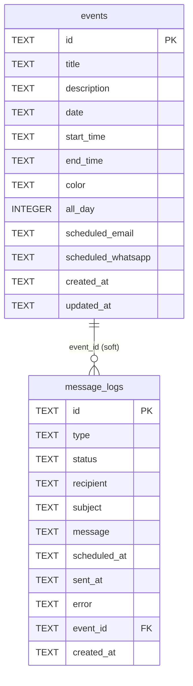

# Database Documentation

The app uses **Turso** — a cloud-hosted SQLite database built on [libSQL](https://github.com/tursodatabase/libsql).
The driver is `@libsql/client`. The database lives in Turso's cloud; nothing is stored locally.

---

## Overview

| Detail | Value |
|---|---|
| Provider | [Turso](https://turso.tech) (libSQL / cloud SQLite) |
| Driver | `@libsql/client` |
| Connection file | `lib/db.ts` |
| Tables | `events`, `message_logs` |
| Init strategy | `CREATE TABLE IF NOT EXISTS` on every cold start |
| ID format | UUID v4 (generated by `node:crypto` `randomUUID()`) |
| Timestamps | ISO 8601 strings stored as `TEXT` (SQLite has no native DATETIME) |

---

## Init Flow

Every API function that needs the database calls `ensureInit()` from `lib/db.ts`.

```
Cold start
    │
    ▼
getClient()
    │  reads TURSO_DATABASE_URL + TURSO_AUTH_TOKEN from env
    │  creates a libSQL Client (singleton — one per cold start)
    ▼
_initialized?
    │  yes ──► return client immediately (skip DDL)
    │  no
    ▼
CREATE TABLE IF NOT EXISTS events         (safe to re-run)
CREATE TABLE IF NOT EXISTS message_logs   (safe to re-run)
    │
    ▼
_initialized = true
    │
    ▼
return client
```

Key design choices:
- **Singleton** — `_client` is a module-level variable, so one TCP connection is reused across requests within the same serverless instance (avoids per-request connection overhead).
- **`IF NOT EXISTS`** — the DDL statements run on every fresh cold start but are safe to repeat; they do nothing if tables already exist.
- **No migration system** — schema changes require manual SQL or dropping/recreating tables. See `docs/suggestions/backend.md` for the suggestion to add numbered migration files.

---

## Table: `events`

Stores calendar events. The `scheduled_email` and `scheduled_whatsapp` columns hold JSON blobs so structured scheduling data can be stored without extra tables.

### Schema (SQL)

```sql
CREATE TABLE IF NOT EXISTS events (
  id                 TEXT PRIMARY KEY,          -- UUID v4
  title              TEXT NOT NULL,
  description        TEXT,                      -- nullable
  date               TEXT NOT NULL,             -- 'YYYY-MM-DD'
  start_time         TEXT,                      -- 'HH:mm', nullable (null = all-day)
  end_time           TEXT,                      -- 'HH:mm', nullable
  color              TEXT DEFAULT 'indigo',     -- one of 6 colour names
  all_day            INTEGER DEFAULT 1,         -- SQLite bool: 1 = true, 0 = false
  scheduled_email    TEXT,                      -- JSON blob (ScheduledEmail) or NULL
  scheduled_whatsapp TEXT,                      -- JSON blob (ScheduledWhatsApp) or NULL
  created_at         TEXT DEFAULT (datetime('now')),
  updated_at         TEXT DEFAULT (datetime('now'))
)
```

### Column details

| Column | Type | Nullable | Notes |
|---|---|---|---|
| `id` | TEXT | NO | UUID v4 primary key |
| `title` | TEXT | NO | Event title |
| `description` | TEXT | YES | Optional notes |
| `date` | TEXT | NO | `YYYY-MM-DD` format |
| `start_time` | TEXT | YES | `HH:mm` — null when `all_day = 1` |
| `end_time` | TEXT | YES | `HH:mm` — null when `all_day = 1` |
| `color` | TEXT | NO | `indigo` \| `emerald` \| `amber` \| `rose` \| `sky` \| `violet` |
| `all_day` | INTEGER | NO | `1` = true, `0` = false |
| `scheduled_email` | TEXT | YES | JSON-serialised `ScheduledEmail` object |
| `scheduled_whatsapp` | TEXT | YES | JSON-serialised `ScheduledWhatsApp` object |
| `created_at` | TEXT | NO | ISO 8601 UTC string |
| `updated_at` | TEXT | NO | ISO 8601 UTC string |

### `scheduled_email` JSON shape

```json
{
  "id": "uuid",
  "to": ["email@example.com"],
  "subject": "Reminder",
  "body": "Don't forget...",
  "scheduledAt": "2026-03-25T08:00:00.000Z",
  "sent": false,
  "sentAt": null
}
```

### `scheduled_whatsapp` JSON shape

```json
{
  "id": "uuid",
  "to": "+972501234567",
  "message": "Reminder text",
  "scheduledAt": "2026-03-25T08:00:00.000Z",
  "sent": false,
  "sentAt": null
}
```

---

## Table: `message_logs`

Tracks every message send attempt — both manual sends and cron-triggered scheduled sends.
The cron job (`api/cron/send-messages.ts`) queries this table for `status = 'pending'` rows and updates them after sending.

### Schema (SQL)

```sql
CREATE TABLE IF NOT EXISTS message_logs (
  id           TEXT PRIMARY KEY,          -- UUID v4
  type         TEXT NOT NULL,             -- 'whatsapp' | 'email'
  status       TEXT NOT NULL DEFAULT 'pending',  -- 'pending' | 'sent' | 'failed'
  recipient    TEXT NOT NULL,             -- phone number or comma-separated emails
  subject      TEXT,                      -- email subject (null for WhatsApp)
  message      TEXT,                      -- message body
  scheduled_at TEXT NOT NULL,             -- ISO 8601 — when to send
  sent_at      TEXT,                      -- ISO 8601 — when actually sent (null until sent)
  error        TEXT,                      -- error message if status = 'failed'
  event_id     TEXT,                      -- FK → events.id (nullable, no constraint)
  created_at   TEXT DEFAULT (datetime('now'))
)
```

### Column details

| Column | Type | Nullable | Notes |
|---|---|---|---|
| `id` | TEXT | NO | UUID v4 primary key |
| `type` | TEXT | NO | `'whatsapp'` or `'email'` |
| `status` | TEXT | NO | `'pending'` → `'sent'` or `'failed'` |
| `recipient` | TEXT | NO | Phone (`+972…`) or comma-separated email addresses |
| `subject` | TEXT | YES | Email subject; always NULL for WhatsApp |
| `message` | TEXT | YES | Message body text |
| `scheduled_at` | TEXT | NO | ISO 8601 UTC — cron checks `<= now()` |
| `sent_at` | TEXT | YES | Set by cron on successful send |
| `error` | TEXT | YES | Error string on failure |
| `event_id` | TEXT | YES | References `events.id` (no enforced FK in SQLite) |
| `created_at` | TEXT | NO | Row creation timestamp |

---

## DSD — Entity Relationship Diagram

```
┌─────────────────────────────────────────────────────────┐
│                         events                          │
├─────────────────┬──────────────────────────────────────┤
│ PK  id          │ TEXT          UUID v4                 │
│     title       │ TEXT NOT NULL                         │
│     description │ TEXT                                  │
│     date        │ TEXT NOT NULL  YYYY-MM-DD             │
│     start_time  │ TEXT           HH:mm                  │
│     end_time    │ TEXT           HH:mm                  │
│     color       │ TEXT           indigo|emerald|…        │
│     all_day     │ INTEGER        1=true, 0=false         │
│     scheduled_  │ TEXT           JSON blob               │
│       email     │                                        │
│     scheduled_  │ TEXT           JSON blob               │
│       whatsapp  │                                        │
│     created_at  │ TEXT           ISO 8601                │
│     updated_at  │ TEXT           ISO 8601                │
└─────────────────┴──────────────────────────────────────┘
         │
         │ event_id (soft reference, no enforced FK)
         │  1 event → 0..N log entries
         ▼
┌─────────────────────────────────────────────────────────┐
│                      message_logs                       │
├─────────────────┬──────────────────────────────────────┤
│ PK  id          │ TEXT          UUID v4                 │
│     type        │ TEXT          'whatsapp' | 'email'    │
│     status      │ TEXT          'pending'|'sent'|'failed'│
│     recipient   │ TEXT          phone or emails          │
│     subject     │ TEXT          email only               │
│     message     │ TEXT          body text                │
│     scheduled_at│ TEXT          ISO 8601 — send time     │
│     sent_at     │ TEXT          ISO 8601 — actual send   │
│     error       │ TEXT          failure reason           │
│ FK? event_id    │ TEXT          → events.id (nullable)   │
│     created_at  │ TEXT          ISO 8601                 │
└─────────────────┴──────────────────────────────────────┘
```

### Mermaid ER diagram (renders on GitHub / Notion)



---

## Row Mapper Functions

`lib/db.ts` exports two functions that convert raw SQLite rows (snake_case) into typed TypeScript objects (camelCase):

| Function | Input | Output |
|---|---|---|
| `rowToEvent(row)` | Raw DB row | `CalendarEvent` (from `event.types.ts`) |
| `rowToLog(row)` | Raw DB row | `MessageLog` (from `event.types.ts`) |

`scheduled_email` and `scheduled_whatsapp` are stored as JSON strings and parsed back into objects by `rowToEvent()`. If parsing fails, the field is omitted (try/catch swallows the error silently).

---

## Common Queries

```sql
-- All events in a given month
SELECT * FROM events WHERE date LIKE '2026-03-%' ORDER BY date ASC;

-- All pending messages due for sending
SELECT * FROM message_logs
WHERE status = 'pending' AND scheduled_at <= datetime('now')
ORDER BY scheduled_at ASC;

-- Events with scheduled WhatsApp messages
SELECT id, title, date, scheduled_whatsapp
FROM events
WHERE scheduled_whatsapp IS NOT NULL;

-- Message delivery stats
SELECT type, status, COUNT(*) AS count
FROM message_logs
GROUP BY type, status;

-- Failed messages with their errors
SELECT id, type, recipient, error, scheduled_at
FROM message_logs
WHERE status = 'failed'
ORDER BY created_at DESC;
```

---

## Viewing the Database in VS Code

The database is hosted in **Turso's cloud** — there is no local `.db` file by default. There are three ways to browse it:

---

### Option 1 — Turso Web Console (no setup)

1. Go to [https://app.turso.tech](https://app.turso.tech) and sign in.
2. Click your database → **"Query"** tab.
3. Run any SQL query directly in the browser.

Best for: quick ad-hoc queries without installing anything.

---

### Option 2 — Turso CLI Shell (in terminal)

Install the CLI if you haven't already:

```bash
# macOS / Linux
curl -sSfL https://get.tur.so/install.sh | bash

# Windows (WSL or Scoop)
scoop install turso
```

Log in and open a shell:

```bash
turso auth login
turso db shell <your-database-name>
```

You now get an interactive SQL prompt:

```sql
.tables                         -- list all tables
SELECT * FROM events LIMIT 10;
SELECT * FROM message_logs WHERE status = 'failed';
.quit
```

Best for: quick terminal queries without leaving your editor.

---

### Option 3 — SQLite Viewer in VS Code (visual table browser)

This requires creating a local copy of the database from Turso.

**Step 1 — Install the extension**

Open VS Code → Extensions (`Ctrl+Shift+X`) → search for:

> **SQLite Viewer** — by Florian Klampfer

Install it. It lets you open any `.db` file and browse tables visually.

**Step 2 — Dump the Turso database to a local file**

Run in terminal (requires Turso CLI + `sqlite3` command-line tool):

```bash
# Export all SQL from Turso
turso db shell <your-database-name> ".dump" > turso_dump.sql

# Import into a local SQLite file
sqlite3 local_copy.db < turso_dump.sql
```

If you don't have `sqlite3` installed:

```bash
# Windows (Scoop)
scoop install sqlite

# macOS
brew install sqlite

# Ubuntu/Debian
sudo apt install sqlite3
```

**Step 3 — Open in VS Code**

In VS Code, open the `local_copy.db` file (File → Open File).
The SQLite Viewer extension will automatically render it as a visual table browser.

> ⚠️ **Note:** `local_copy.db` is a snapshot — it won't auto-update. Re-run the dump command whenever you want a fresh copy. Never commit this file to git (add `*.db` to `.gitignore`).

---

### Option 4 — Database Client extension (multi-database GUI)

Install: **Database Client** by Weijan Chen (`cweijan.vscode-database-client2`)

This extension supports MySQL, PostgreSQL, SQLite, and others. For Turso:
1. Open a local `.db` file (from the dump above) directly via the extension's "New Connection" → SQLite.
2. Browse tables, run queries, and view results in a spreadsheet-like panel.

---

## Environment Variables

The database connection requires two variables (set in `.env.local` locally, and in Vercel dashboard for production):

| Variable | Description |
|---|---|
| `TURSO_DATABASE_URL` | `libsql://<db-name>-<org>.turso.io` |
| `TURSO_AUTH_TOKEN` | Auth token from `turso db tokens create <db-name>` |

See `docs/turso-setup.md` for the full setup walkthrough.
